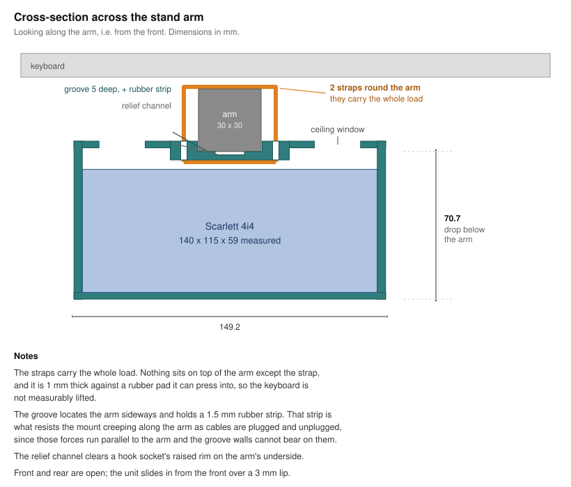

# Scarlett 4i4 under-keyboard mount

Gets a **Focusrite Scarlett 4i4 4th gen** off the desk and under the keyboard, by
hanging it from one of the top support arms of a **Donner Z-type keyboard stand**
(the 60–85 cm model with casters, Amazon ASIN B09G2QK6B3), carrying an 88-key
board.

`model.scad` is the deliverable and the source of truth. `model.stl` is a
by-product, committed only because slicing happens on a different machine, and is
regenerated whenever a parameter changes.



## What it is for

The stand's two top arms run **front to back**, one on each side frame, and the
keyboard lies across them. The mount straddles one arm, so the unit hangs
directly below it with its front panel facing the player, near one end of the
keyboard and clear of the player's knees.

Front and rear are open, so the front-panel jacks and the rear USB-C and line
outputs stay reachable. The **top panel does not** — that is inherent to putting
the unit under a keyboard, not a limitation of this bracket.

## How it mounts, and why not otherwise

A grooved band down the centre of the ceiling beds against the **underside** of
the arm, and two straps (zip ties or hook-and-loop) pass up through four slots
and around the arm. The straps carry the whole load.

Two more obvious approaches were tried on paper first and rejected:

- **Hooking over the arm.** Hanging from a bar needs material *above* it, which
  would sit between the arm and the keyboard and lift one side of the keyboard.
  Worse, a downward-open hook cannot be lowered onto an arm that is captive in
  the frame: the mount's own floor collides with the arm on the way down. Making
  the whole part straddle a full-width slot to clear it would gut the structure.
- **Bolted clamp jaws.** Stronger and immune to strap relaxation, but it needs
  the arm's cross-section to be matched closely, adds hardware, and adds print
  time. Held in reserve; see *Known weakness* below.

Strapping also has the property that it barely cares about the arm's
cross-section, which mattered while the stand was still unmeasured.

The ceiling is a **full plate**, not just a band the width of the arm. With the
arm running front to back, a band alone would only reach the front lip and rear
stop, so the shell has to hang from a plate that reaches the side walls. The
plate is thin (3.2 mm) away from the band and windowed to keep the mass down.

## Known weakness

Plugging and unplugging front-panel cables pushes and pulls **along** the arm, so
the groove walls have nothing to bear against and only strap friction resists it.
Bare nylon on painted steel gives a coefficient of roughly 0.25, which is not
enough on its own.

**Lay a ~1.5 mm rubber strip in the groove.** A scrap of shelf liner or inner
tube will do. It takes the coefficient to ~0.8. `groove_depth` is sized to
swallow the strip and still leave positive engagement.

With the 3 x 1 mm ties in hand this is the tightest margin in the whole design.
Each loop clamps the band to the arm with about twice its own tension, so two
loops hand-tightened to 40-60 N give 160-240 N of normal force, and with the
rubber that is 130-190 N of friction against a ~50 N pull: **3-4x**. Without the
rubber it is about 1x, i.e. it would creep. Heavier ties or four instead of two
raise it proportionally. The tie rating assumed here is inferred from the size,
not read off a datasheet.

The failure mode is gradual creep along the arm, not breakage: visible and
re-tightenable rather than sudden. Nylon ties do relax, so re-tighten after a few
weeks.

Holding the weight is not the problem. At ~0.96 kg the four tie legs run about
30x under their rating and the ceiling's bending stress roughly 50x under PLA's
strength, both by hand calculation.

## Dimensions

| | |
|---|---|
| Overall | 189.2 × 121.8 × 75.7 mm |
| Drop below the arm's underside | **70.7 mm** |
| Thinnest wall | 2.5 mm |
| Solid volume | 166.2 cm³ (≤ ~206 g in PLA — an upper bound, not a slicer estimate) |

The drop is the number that matters on this stand: the side frame's upright is
angled, so the clear length along the arm shrinks the lower you go. There is
245 mm of clear arm between the frame junction and the arm's tip, against the
mount's 121.8 mm, so it fits with a lot of room. With the arm's underside 593 mm
off the floor the bottom of the mount sits at about 522 mm, and it hangs at the
far left or right of the stand rather than over the player's knees.

### Measured

- Unit 180 x 115 x 59 mm. Width and height match Focusrite's published figures;
  the depth is 14 mm under their 129, which is consistent with the published
  number covering front and rear protrusions the chassis itself does not have.
- The lowest feature on the rear panel sits about 10 mm above the underside of
  the feet, so the rear stop is 7 mm rather than the 14 mm it started at. It only
  has to arrest the unit as it slides back; nothing loads it.
- Arm 30 x 30 mm, square section.
- 245 mm clear along the arm from the frame junction to the tip, and 593 mm from
  the floor to the arm's underside.
- Zip ties 3 mm wide, 1 mm thick. The slots are sized well over that; see below.
- A hook socket on the arm's underside with a ~1 mm raised rim. Rather than
  positioning the mount to dodge it, the groove floor carries a relief channel
  down its centre, so the arm beds on two shoulders and the rim has somewhere to
  go wherever it sits along the arm.
- A rubber pad covering roughly the outer 100 mm of the arm. Place the straps
  clear of it and the keyboard is not lifted at all.

### Still unverified

Nothing dimensional. What has not been established is whether the mount actually
holds in use — see *Known weakness* — and nothing here has been sliced or
printed.

## Building

```sh
direnv allow          # or: nix develop
scripts/build.sh model.scad     # from the 3d-print skill
```

The repo's dev shell supplies `jq` everywhere and OpenSCAD on Linux. On macOS
OpenSCAD comes from the desktop app instead — `brew install --cask openscad` —
because the live preview is needed there anyway and that one install already puts
the same binary on PATH as the CLI. See the repo README for why.

The build reads `printer.json` from the repo root, so it targets the same printer
on every machine.

That exports `model.stl`, renders five views into `build/`, and prints one JSON
report. `build/` is regenerable and gitignored.

The report checks four things only: the result is 3D, it is not empty, it fits
the bed, and the echoed thinnest wall clears two nozzle widths. Manifoldness,
disjoint bodies, overhang angles, and whether it actually prints are **not**
checked.

For live tuning, open `model.scad` in the OpenSCAD desktop app and turn on
*Design → Automatic Reload and Preview*. Every dimension is a parameter at the
top of the file, so it also appears in the Customizer.

## Printing

**Stand it on the rear face** — rotate 90° about X in the slicer, or set
`orient_for_print = true` to export it already rotated. The part is then a
rectangular tube standing on a closed perimeter ring: every wall vertical, the
load path inside the layers rather than across them, and good bed adhesion.

No supports, and nothing has to be bridged further than 3 mm. A slicer will still
warn about long bridging extrusions: the front lip's inner face is a 181 x 3 mm
horizontal surface that appears in a single layer near the top of the print
(around z = 119 mm). It is anchored along its whole 181 mm lower edge to the floor
directly beside it, so the actual unsupported distance is 3 mm — the warning
counts extrusion length, not span. It prints.

The lip keeps a vertical face deliberately. A 45 degree chamfer would silence the
warning and turn a positive stop into a ramp: as it stands the unit has to be
lifted 3 mm to escape, whereas off a 45 degree ramp roughly 15 N of forward pull
would walk it out, and unplugging a stiff jack applies more than that.

That orientation makes the build direction −Y, so each layer is one cross-section
through the depth of the box, and **every lightening window has an end that
closes in the build direction**. A square-ended window would have to be bridged
there — the floor window alone would have been a 149 mm bridge. So all window ends
taper at 45° (`window_2d`) and the floor window is split into three.
`window_taper` raises that angle if the ends droop on a first print.

Nothing here has been sliced. Print time, filament use, and whether a slicer
accepts the file are all unverified.

## Assembly

1. **Strap the empty mount to the arm first**, with the rubber strip in the
   groove. A zip tie's head ends up under the ceiling, in the headroom above the
   unit, so it has to be tightened before the unit goes in.
2. **Slide the Scarlett in from the front**, tilting it over the 3 mm lip. The
   4.5 mm of headroom exists for exactly that. It stops against the rear stop.
